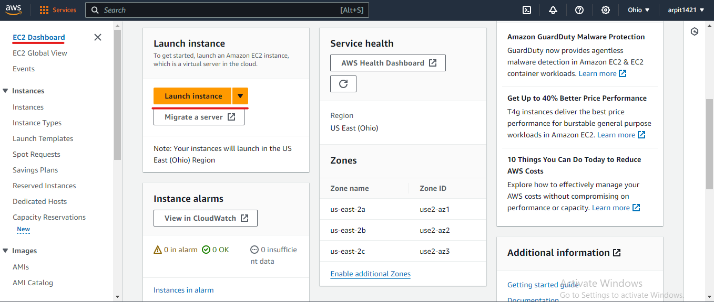
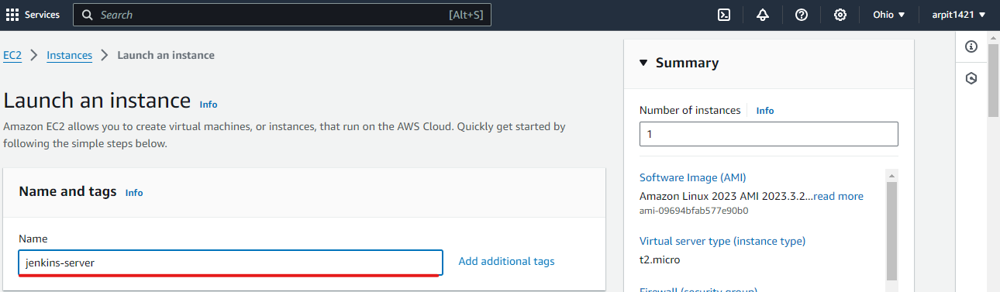
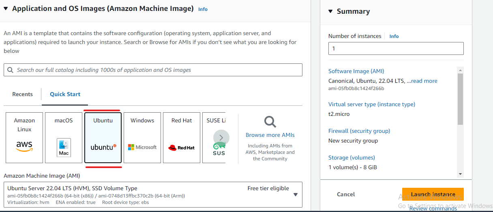
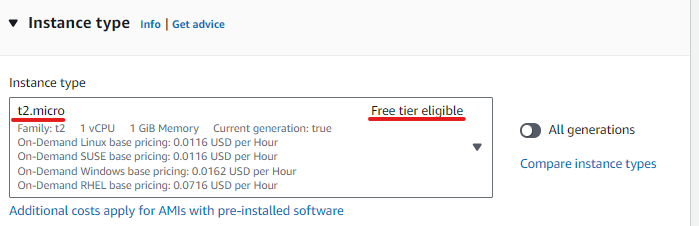
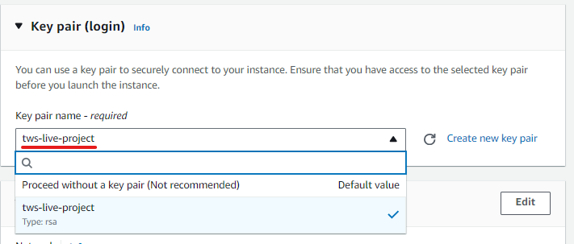
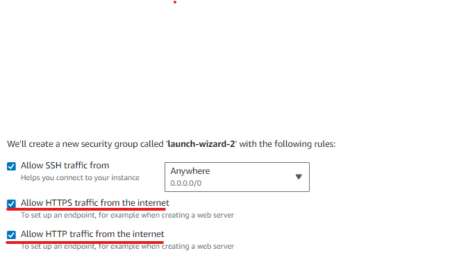
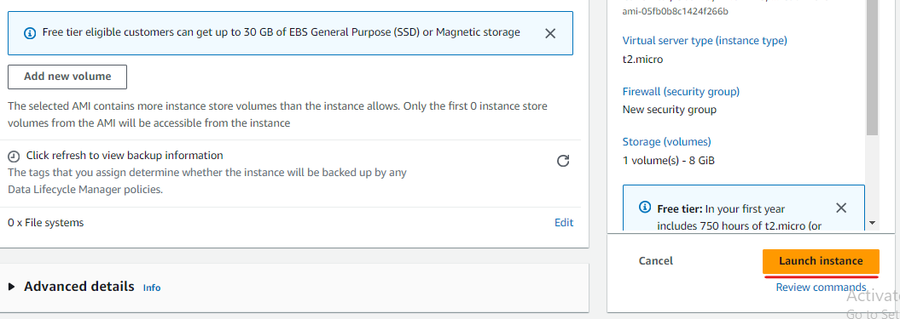
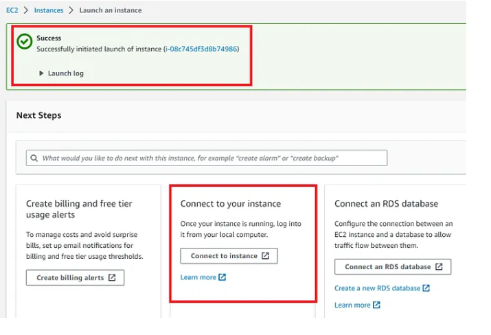
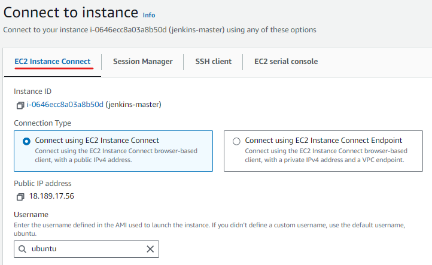

                                **Complete Step-by-Step Jenkins CICD with GitHub Integration**

**Overview:**

CI/CD is a way to introduce automation during app development stages and deliver apps to customers in bulk. The basic concepts of CI/CD are continuous integration, continuous delivery, and continuous deployment.

Thus, CI/CD has become an integral part of the software development cycle, with many frameworks and tools available. We will use Amazon Web Services (AWS) as a cloud platform, GitHub for code repositories, Jenkins for Continuous Integration (CI), and Continuous Delivery (CD).

**Requirements:**

AWS account.
Jenkins and Docker are to be installed on the AWS EC2 Instance
GitHub repo (code)

**Step 1:** Setup AWS EC2 Instance
We will first create an AWS Instance (Ubuntu) free-tier eligible using the AWS console.

Steps To launch the EC2 instance:
1. Open the Amazon EC2 console at https://console.aws.amazon.com/ec2/.
2. Choose Launch Instance.

3. Once the Launch an instance window opens, provide the name of your EC2 Instance:

4. Choose the Ubuntu Image (AMI):

5. Choose an Instance Type. Select t2.micro for our use case which is also free-tier eligible.

6. Select an already existing key pair or create a new key pair. In my case, I will select an existing key pair.

7. Edit Network Settings, create a new Security Group, and select the default VPC with Auto-assign public IP in enable mode. Name your security group and allow ssh traffic, HTTPS, and HTTP everywhere (we can change the rules later).

8. Leave the rest of the options as default and click on the Launch instance button:

9. On the screen you can see a success message after the successful creation of the EC2 instance, click on Connect to instance button:

10. Now connect to instance wizard will open, go to EC2 Instance connect tab and click on it :

