                                Complete Step-by-Step Jenkins CICD with GitHub Integration

**Overview:**

CI/CD is a way to introduce automation during app development stages and deliver apps to customers in bulk. The basic concepts of CI/CD are continuous integration, continuous delivery, and continuous deployment.

Thus, CI/CD has become an integral part of the software development cycle, with many frameworks and tools available. We will use Amazon Web Services (AWS) as a cloud platform, GitHub for code repositories, Jenkins for Continuous Integration (CI), and Continuous Delivery (CD).

**Requirements:**

AWS account.
Jenkins and Docker are to be installed on the AWS EC2 Instance
GitHub repo (code)

**Step 1: Setup AWS EC2 Instance**

We will first create an AWS Instance (Ubuntu) free-tier eligible using the AWS console.

Steps To launch the EC2 instance:
1. Open the Amazon EC2 console at https://console.aws.amazon.com/ec2/.
2. Choose Launch Instance.

3. Once the Launch an instance window opens, provide the name of your EC2 Instance:

4. Choose the Ubuntu Image (AMI):

5. Choose an Instance Type. Select t2.micro for our use case which is also free-tier eligible.

6. Select an already existing key pair or create a new key pair. In my case, I will select an existing key pair.

7. Edit Network Settings, create a new Security Group, and select the default VPC with Auto-assign public IP in enable   mode. Name your security group and allow ssh traffic, HTTPS, and HTTP everywhere (we can change the rules later).

8. Leave the rest of the options as default and click on the Launch instance button:

9. On the screen you can see a success message after the successful creation of the EC2 instance, click on Connect to instance button:

10. Now connect to instance wizard will open, go to EC2 Instance connect tab and click on it :

11. New Window tab will open with EC2 Intance terminal 

**Step 2: Install Jenkins on EC2 Instance:**

Jenkins installation is straightforward:

1. First Update your Server with the command

                                            $  sudo apt-get update 

2. Install Java

                                            $ sudo apt install openjdk-11-jre

3. Verify Java Installation:

                                            $ java -version

It should look something like this

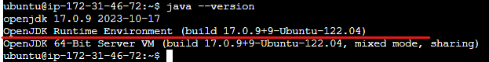

4. Install Jenkins:
Just copy these commands and paste them onto your terminal.

                                        $ curl -fsSL https://pkg.jenkins.io/debian/jenkins.io.key | sudo tee \   /usr/share/keyrings/jenkins-keyring.asc > /dev/null
                                        $ echo deb [signed-by=/usr/share/keyrings/jenkins-keyring.asc] \   https://pkg.jenkins.io/debian binary/ | sudo tee \   /etc/apt/sources.list.d/jenkins.list > /dev/null
                                        $ sudo apt-get update
                                        $ sudo apt-get install jenkins

5. Start Jenkins:

                                        $ sudo systemctl enable jenkins
                                        $ sudo systemctl start jenkins
                                        $ sudo systemctl status jenkins

With these changes, our Jenkins Server should be installed on our EC2 Server. Before we access our Jenkins Server on our browser, let's open the default TCP port 8080 under the Security Group of your Instance and allow MYIP only to access the Server.

To verify the installation of Jenkins we can take the public IP of our EC2 Instance and paste it into our browser with a default port of Jenkins 8080.
Then the Jenkins Page would appear as below:

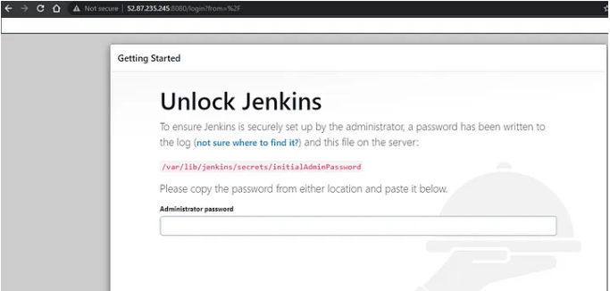

Now to unlock Jenkins we need to go to this path /var/lib/jenkins/secrets/initialAdminPassword and copy the administrative password and paste it into the above screenshot.

After pasting the password the below page will appear. Click on Install suggested plugins.

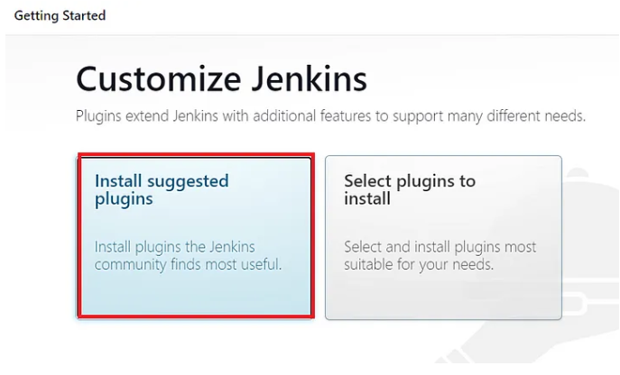

After the plugins are installed, you need to create the first Admin User. Fill in all the information and click on Save and Continue.

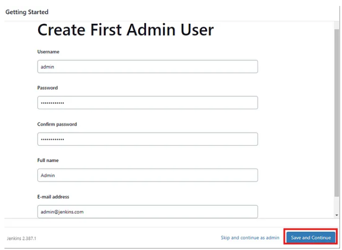

Then the wizard will display the Jenkins URL through which you will be able to access the Jenkins Server. Click on Save and Finish and start using Jenkins.

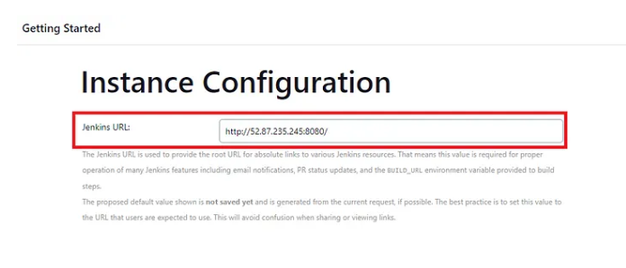

**Step 3: Start Using Jenkins:**

On Jenkins Dashboard, Click on New Item to create your first job or item.

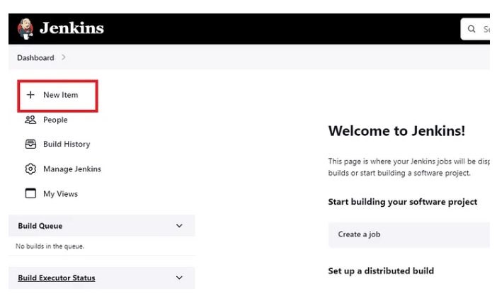

2. Enter the name of your first item and select Freestyle Project and click on Ok.

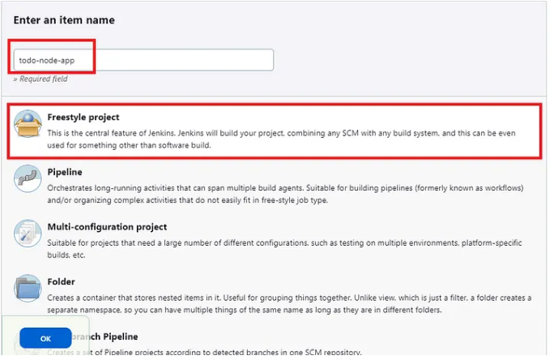

3. Now we need to configure various parameters of our first job in Jenkins. Under the General section, put the description of your project. Under Project Url paste the GitHub URL of the project for which we need to create the CI CD Pipeline.

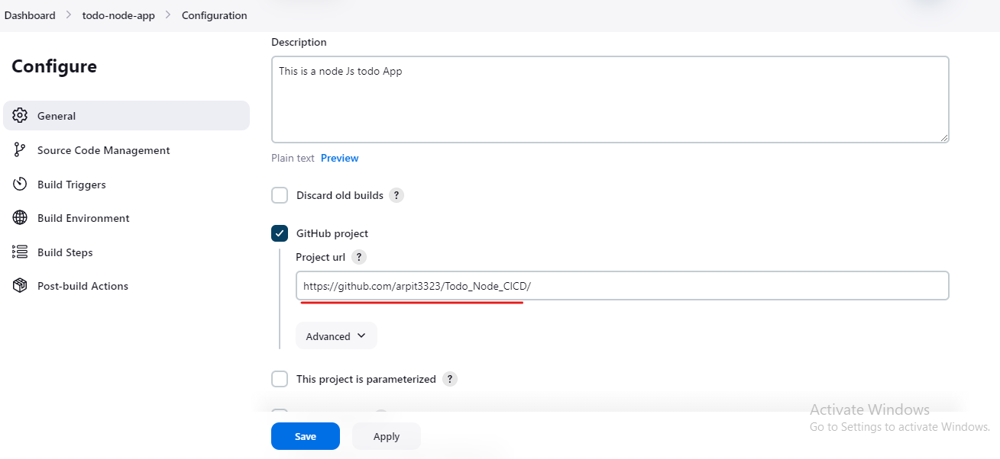

4. Under Source Code Management we need to paste the GitHub repository URL as shown in the below screenshot:

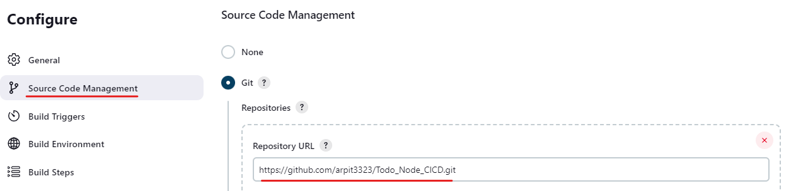

Under credentials, we first need to generate the ssh keys on our EC2 Server.
The reason to create ssh keys is to make secure integration between our Jenkins Server and Github and this way we can clone any git repo in this Jenkins instance. You do not need to provide the credentials while configuring the job in Jenkins.

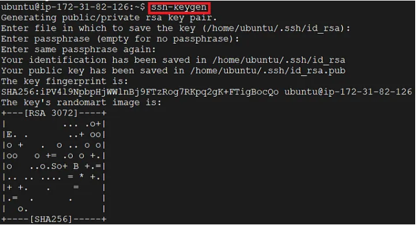

Take the public key and insert that under the settings in GitHub to achieve a password-less connection between Jenkins and GitHub.

For that go to the settings of your GitHub, on the left choose SSH and GPG keys, click on New SSH key, give the name under Title, and paste the public key under the Key section we previously generated on the EC2 server.

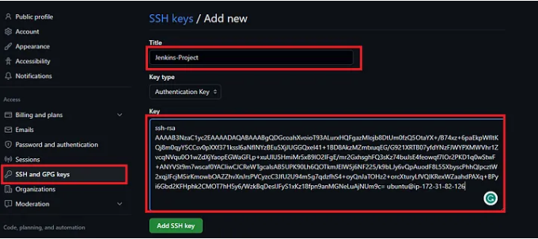

After adding the ssh key to our GitHub account we will add the credentials in Jenkins. For that, under credentials click on Add button and click on Jenkins in the drop-down option.

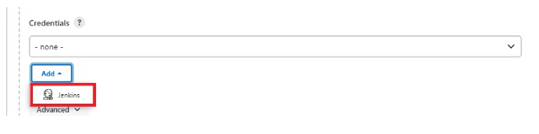

A new window will appear. Select SSH Username with private key under the section Kind. Give any name under section ID and Description, as shown in the below screenshot:

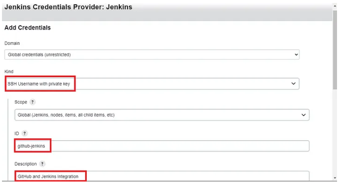

On the other half of this page type the Username of the EC2 machine which in our case is ubuntu and then paste the private ssh key copied from your EC2 server and click on Add button.

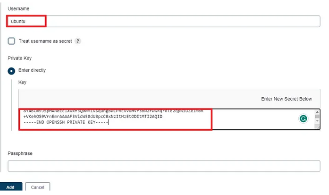

Now we have to specify the branch of our GitHub repository. It can be any branch the developer would have been working on. In our case, we will select the main  branch.

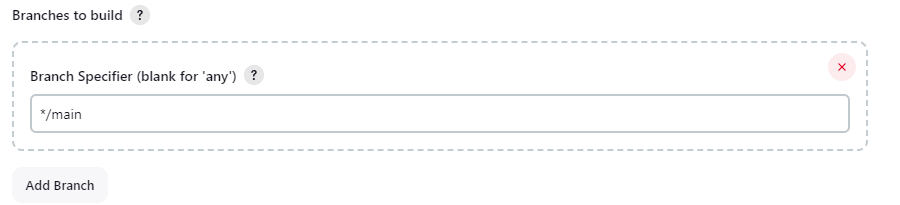

This is all we need so far as the configuration of our first job is concerned. We can save this part of the configuration and move to the next step of building the project.

5. To check whether our GitHub integration with Jenkins is successful we will do a small test by clicking on Build Now on the left navigation bar in our first job as shown below:

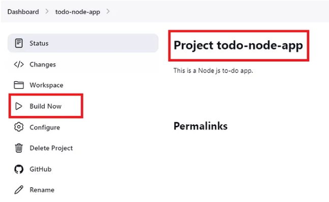

After clicking on Build Now we see in the output console that the build has been finished successfully and Jenkins was able to fetch the code from our GitHub repository. That means Jenkins Integration with GitHub is successful.

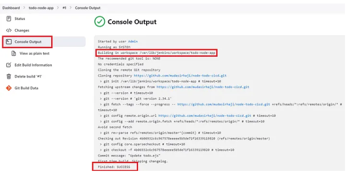

We can also verify by navigating to the path mentioned in the output console which is:

                                         /var/lib/jenkins/workspace/todo-node-app

And check if the repo is cloned there. As shown in the below screenshot we see all the files of the GitHub repo have been successfully cloned.

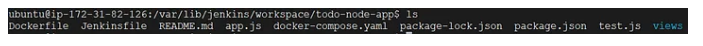

**Step 4: Run the code:**
To run the code we will go through the steps provided by the developer in the Readme file of the Repo which is as shown below:

                                        sudo apt install nodejs 

                                        sudo apt install npm

                                        npm install

                                        node app.js

Let’s run these commands on the EC2 Instance one by one:

                                         $ sudo apt install nodejs

**Output:**

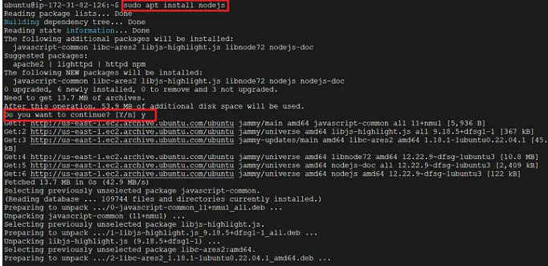

                                        $ sudo apt install npm

**Output**

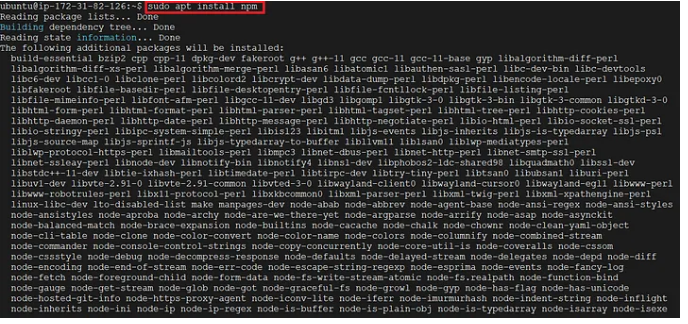

                                         $ npm install

The above command will install the dependencies mentioned in the file package.json (ignore the warnings in the output)

**Output:**

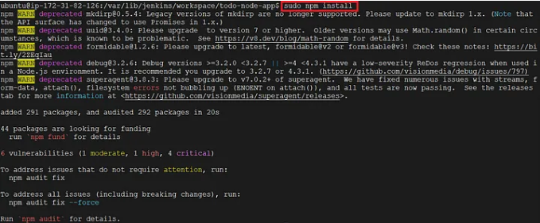

Finally, to run the app we need to execute the final command, however, before that we also need to allow port 8000 in the Security group of our EC2 Instance as this app will be running on port 8000.

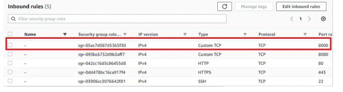

After allowing port 8000 in the inbound policy of Security Group we will run the final command as:

                                        $ node app.js

To check the output open your browser take the public IP of your EC2 Instance with port 8000 and you will see the result as:

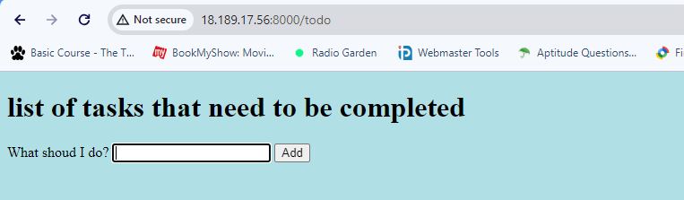

**At this point, we are running the app on our Server and if we stop our service the app will be no longer available to others so for the app to be accessible anywhere by anyone we need to dockerize the application.**

**Step 5: Install Docker on EC2 Instance:**

1. Install Docker with the following command:

                                      $ sudo apt install docker.io

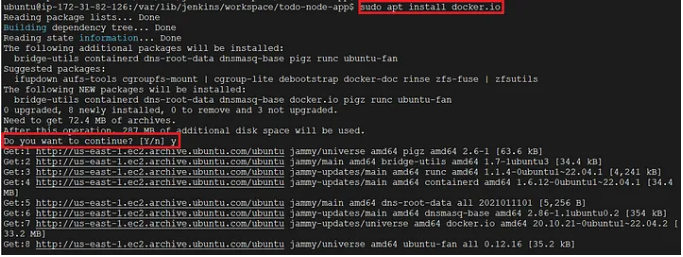

2. Create your Dockerfile:
We will create the Dockerfile in the same directory **/var/lib/jenkins/workspace/todo-node-app**

                                      FROM node:12.2.0-alpine
                                      WORKDIR app
                                      COPY . .
                                      RUN npm install
                                      EXPOSE 8000
                                      CMD ["node", "app.js"]

3. Now we will build the Image using the Dockerfile created in the above step:

                                     $ docker build . -t todo-node-app

In the below output watch the build steps which match with the instructions in the Dockerfile:

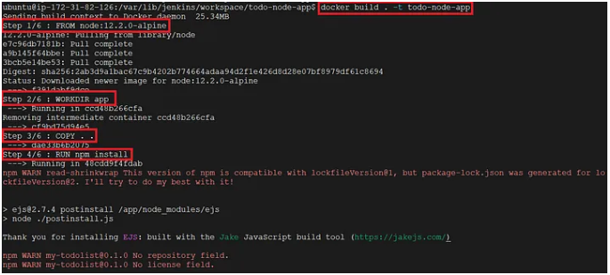

We have successfully built the Image from the Dockerfile:

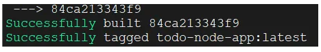

4. Now its time to build the container from the same Image

                                     $ docker run -d --name node-todo-app -p 8000:8000 todo-node-app

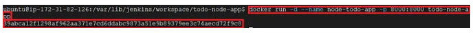

[def]: image.png